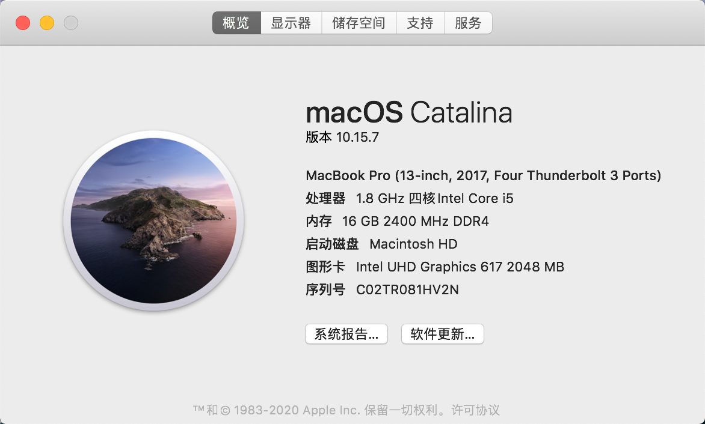
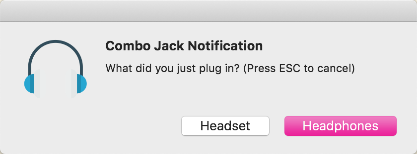
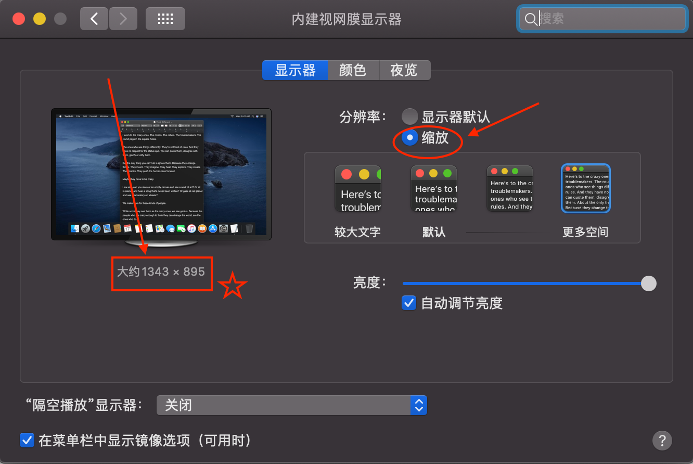
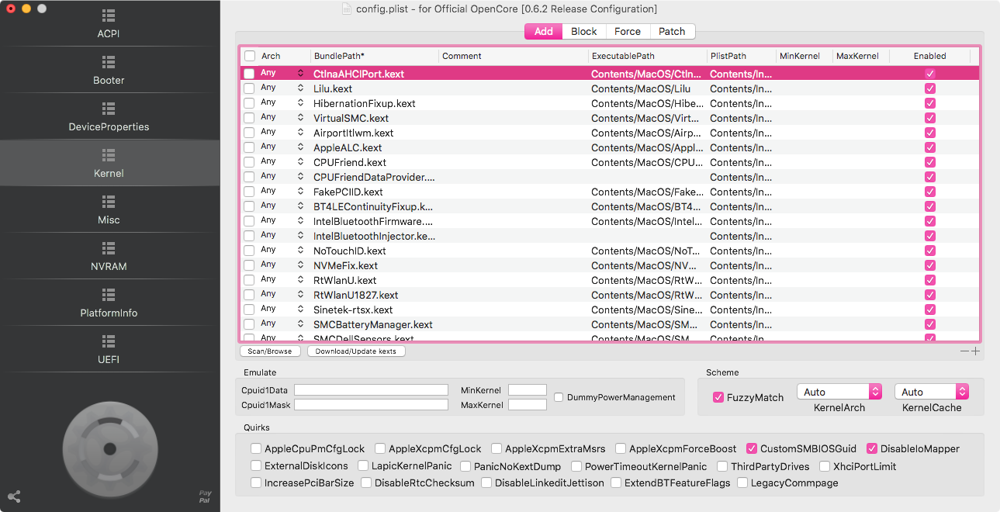

# Dell Vostro 5370 Catalina (and Big Sur)
在Dell Vostro 5370上运行macOS Catalina或Big Sur所需的所有资源的集合

## 🔍 总览
| 规格   | 详细信息                |
|------ |---------------------   |
| 电脑型号 | DELL-Vostro-5370      |
| 处理器  | 英特尔 酷睿 i5-8250u处理器  |
| 内存   | 16GB DDR4 2400MHz      |
| 硬盘   | SK hynix SC311 SATA 256GB |
| 集成显卡 | 英特尔图形卡 UHD 620      |
| 声卡   | 瑞昱 ALC295           |
| 网卡   | Intel Wireless 3165 |
## 正常可用和不可用的部件：

| 特征           | 状态          | 备注 |
| ------------- | ------------- | ------------- |
| **Intel iGPU**              | ✅ 正常工作                              | 完全支持。通过HDMI的1920x1080 @ 60Hz外接显示器经过测试，正常工作。                                                                                                                                                                             |
| **触控板**                   | ✅ 正常工作     | 触摸板手势支持拖移锁定。可能是非Mac上最好的触控板体验。                                                                                                                                                                                                 |
| **iMessages 和 Facetime**  | ✅ 正常工作   | 只需遵循指南注入白果三码#通过Hackintool-changing-serial-number,-board-serial-number-and-smuuid                                                                                                                                                                 |
| **扬声器 和 耳机**            | ✅ 正常工作  | 要修复耳机，请按照此处的说明进行操作指南#通过安装ComboJack-audio修复                                                                                                                                                                                       |
| **内置麦克风**                | ✅ 正常工作                                                                                                                                                                                                                                                                                                      |
| **摄像头**                   | ✅ 正常工作                              | 正常运行，被检测为集成网络摄像头                                                                                                                                                                                                                           |
| **Type-C**                  | ✅ 正常工作                                                                                                                                                                                                                                                                                                                                                                                                                                                                                                       |
| **SD读卡器**                 | ✅ 正常工作    | 完全支持，但速度较慢                              
| **Wi-Fi/BT**                | ✅ 正常工作|                                                                                                                                |
| **电池电量显示**              | ✅ 正常工作           
| **睡眠和变频**                | ✅ 正常工作            
| **支持原生亮度快捷键**         | ✅ 正常工作      | 支持16档亮度调节            
| **支持fn+insert睡眠**         | ✅ 正常工作      | 外接显示器时，此组合键关闭内置显示器，无外接显示器按此组合键就睡眠          
| **AMD GPU**                 | ❌ 已屏蔽| 由于AMD 530在Apple Mac下无法工作。因此，它完全被禁用以节省功率。                                                                                                                |
| **SK hynix SSD**            | ❌ 工作异常 for Big Sur OS                          | U盘升级Big Sur系统中，在进入磁盘工具界面不能识别出来，为了更好的体验Mac系统，只需将其替换为受支持的NVMe驱动器即可，或者参考下面的指南添加AppleAHCIPort屏蔽补丁。                                                     |
| **指纹识别器**                 | ❌ BIOS下关闭即可   |可能永远无法使用，因为只能使用Windows专有的Goodix驱动程序。禁用以节省功率。                                                                                                                                              |

## ⬇️ 指南阅读
## ⬇️ 安装
如果您以前从未设置过Hackintosh，请按照本指南进行操作。

### 创建一个可启动的安装程序
要启动，您需要一个具有至少12GB可用存储空间的USB闪存驱动器以及一个macOS本地副本。可以从此处获得macOS Catalina的安装程序。 [下载系统安装程序](https://cloud.189.cn/t/ZzUBz27jYbmy).

接下来，您要使用“磁盘工具”格式化USB闪存驱动器。单击工具栏中的“查看”，然后选择“显示所有设备”以查看所有物理磁盘，而不只是分区。选择您的USB闪存驱动器，将其命名为“ MyVolume”，并使用GUID分区图将其格式化为HFS + / Mac OS Extended（日志式）。

现在您可以创建安装介质了。使用以下命令开始该过程。可能需要一段时间，具体取决于所使用的USB闪存驱动器。

`sudo /Applications/Install\ macOS\ Catalina.app/Contents/Resources/createinstallmedia --volume /Volumes/MyVolume`

如果您的USB闪存驱动器具有不同的名称，请替换MyVolume为卷的名称。

在安装程序说完之后，该卷现在包含macOS Catalina安装程序，可以在真实Mac上启动了。但是，由于我们正在构建Hackintosh，因此我们必须采取其他步骤并安装OpenCore引导加载程序。为此，您首先必须安装EFI分区。这是OpenCore及其所有配置文件的存放地。使用以下命令列出所有磁盘。

`sudo diskutil list`

找到您的USB闪存驱动器的EFI分区。通常，其条目1在/ dev / disk2下。使用以下命令挂载EFI分区-在这种情况下为disk2s1。

`sudo diskutil mount disk2s1`

现在您可以访问EFI分区，真正的乐趣开始了。

### 配置EFI
克隆此存储库以获取基本EFI文件夹以及所有其他kext和补丁。现在，您必须为您的硬件配置准备EFI文件夹。有两个不同的配置，分别为CLOVER和OC。通读配置部分以了解有关不同选项的更多信息。正确配置所有内容后，将文件夹复制到上一步中已安装的EFI分区中。

### 引导安装程序
创建安装程序USB闪存驱动器后，即可进入引导安装macOS。确保将SSD模式设置为AHCI模式而不是BIOS中的RAID，否则，macOS将无法检测到您的SSD。选择您的USB闪存驱动器作为启动媒体，然后像在实际Mac上一样通过macOS安装程序。进入桌面后，请继续进行下一步。

### 安装后
恭喜你！您已成功启动并安装了macOS。此时，您只需要将上一步中准备的EFI文件夹复制到SSD。使用以下命令挂载SSD的EFI分区

`sudo diskutil mount disk0s1`

并将您的自定义EFI文件夹复制到新安装的EFI分区中。现在，您应该能够在未连接USB闪存驱动器的情况下启动计算机。如果您对Wi-Fi，蓝牙或音频等特定部分有疑问，请查看此存储库中的相应部分，如果无法解决，请查看[以下 指南](# 安装中遇到的问题)。

## 🛠 部件
本部分讨论为您的确切硬件配置EFI文件夹。

几乎所有更改都在OpenCore配置文件中完成。使用提供的ProperTree版本进行编辑EFI/OC/config.plist。

### 🔈 Audio
默认情况下，音频可能有问题。使用耳机时，一段时间后音频会随机停止。有时拔出并重新插入耳机是可行的，但这很烦人并且不可靠。要永久解决此问题，您必须通过运行从文件夹安装ComboJack。安装ComboJack实现耳机耳麦切换，改进电流声。
（修复耳机接口）在这里下载由Heporis制作的[ComboJack](https://github.com/randomprofilename/ComboJack)。

终端运行以下路径的脚本
`ComboJack_Installer / install.sh`

### 📶 Wi-Fi/Bluetooth
【AirportItlwm】
1. 支持原生Wi-Fi选择、切换，支持wpa/wpa2/无加密Wi-Fi连接
2. 支持定位
3. 完美支持接力Handoff
注意这里iphone的智能热点可以被识别，但是可能不能连接，如有智能热点连接需求的，请使用itlwm.kext；蓝牙接力异常，连接立即会断开，是因为接入的网络频段为2.4Hz,必须使用蓝牙接入网络为5GHz频段，才能接力. 
目前支持10.15、11.0系统，需要搭配最新的oc0.6.1 使用，clover用户及旧版oc用户可以使用套娃IO80211Family方案，这里不做赘述。[WIFI](https://github.com/OpenIntelWireless/itlwm/releases)
[Bluetooth](https://github.com/OpenIntelWireless/IntelBluetoothFirmware/releases/tag/1.1.2)
[HeliPort](https://github.com/OpenIntelWireless/HeliPort)

该存储库配置为可以与Dell DW1830和DW1560无线适配器一起使用。
价格低廉的另一种选择是Dell DW1820a。但是，它比上面提到的网卡慢一些，以我的经验，某些5GHz网络存在问题。

### 📺 开启HIDPI
⚠️注意：
根据你的系统版本去下载（获得）开启hidpi的脚本，哈！

Big Sur： [下载地址](https://github.com/ske1996/matebook-13-2019-oc-efi/raw/master/Bigsur/%EF%BC%88BigSur%E6%96%B9%E6%A1%882%EF%BC%89hidpi.zip)

Catalina：[下载地址](https : //github.com/xzhih/one-key-hidpi)

我说下我的选择步骤：
选择开启HiDPi（注入的ID ）
第二步选择保持原样
第三步选择手动输入分辨率
分辨率输入的是1600x1066 1343x895 2160x1440,如下图所示：


最后说一句，开启了hidpi之后，在设置→显示器里不要让分辨率超过1343x895，最大只能到这个，因为超过这个会引发一些唤醒后屏幕显示的问题（例如唤醒后屏幕只显示到四分之三），而且不要觉得这个分辨率小，因为这个是hipdi分辨率，跟你理解的分辨率不一样，1343×895实际上等于你理解的一般分辨率的2686×1790，是超过2k的。

### 🔋 睡眠管理-sleepwatcher
Hackintosh不支持休眠，因此应完全禁用与休眠有关的所有功能。禁用其他功能可防止在盖子关闭时随机唤醒。每次更新后，应手动重新应用这些设置。

```
sudo pmset -a hibernatemode 0
sudo rm -f /var/vm/sleepimage
sudo mkdir /var/vm/sleepimage
sudo pmset -a standby 0
sudo pmset -a autopoweroff 0
sudo pmset -a powernap 0
sudo pmset -a proximitywake 0
sudo pmset -b tcpkeepalive 0 (optional)
```

### ⚡️ CPU变频-one-key-cpufriend
通过CPUFriend.kextwhileCPUFriendDataProvider.kext定义完成CPU电源管理的方式。CPUFriendDataProvider.kext为特定的CPU和电源设置生成。该存储库中提供的一个是为i5-8250U设计的，并针对最大性能进行了优化。如果您有其它CPU或宁可牺牲在贸易中的一些表现为更多的电池寿命，你可以使用脚本[一键cpufriend](https://github.com/stevezhengshiqi/one-key-cpufriend) 从tools文件夹中生成自己的CPUFriendDataProvider.kext。
 
 
### ℹ️ 注入白果三码-更改序列号，主板序列号和SmUUID
要使用iMessage和其他Apple服务，您需要生成自己的序列号。这可以使用Hackintool完成。转到“序列”标签，并确保将模型设置为MacBookPro14,2。使用带苹果条形码的按钮检查您生成的序列号。如果网站告诉您序列号无效，则一切正常。否则，您必须生成一个新集合。

接下来，您必须将以下值从Hackintool复制到您的config.plist：

序列号-> Root/PlatformInfo/Generic/SystemSerialNumber
主板序列号-> Root/PlatformInfo/Generic/MLB
SmUUID-> Root/PlatformInfo/Generic/SystemUUID
重新启动，Apple服务应该可以工作。

### ℹ️ Big Sur 安装时磁盘工具找不到内置硬盘的解决办法
问题描述：
U盘升级Big Sur系统中，出现了安装时磁盘工具找不到内置硬盘的问题。
解决方案：
究其原因，是因为苹果在新版系统中的 AppleAHCIPort.kext 内移除了 AppleIntelPchSeriesAHCI 类，导致 id 伪装失败，SATA-unsupported.kext 无法工作。
根据建议，在 oc 中屏蔽了 11.0 系统的 AppleAHCIPort.kext ，并且注入修改后的 10.15 版本驱动可以解决。
首先下载 CtlnaAHCIPort.kext.zip（https://github.com/dortania/OpenCore-Install-Guide/blob/master/extra-files/CtlnaAHCIPort.kext.zip），解压，进入包内容，编辑 Contents/Info.plist 文件，修改 IOKitPersonalities 字段内的信息为自己电脑的相应值即可。比如我是 8 代，设备 id 为9d03和082e，(设备id提取方法详见[黑苹果big sur不识别内置硬盘解决办法，希望能帮到你](http://bbs.pcbeta.com/forum.php?mod=viewthread&tid=1869594&highlight=%C4%DA%D6%C3%D3%B2%C5%CC)）修改如下：
```
<dict>
<key>Intel8SeriesAHCI</key>
<dict>
<key>CFBundleIdentifier</key>
<string>com.apple.driver.CtlnaAHCIPort</string>
<key>Chipset Name</key>
<string>8 Series Chipset</string>
<key>IOClass</key>
<string>CtlnaIntelPchSeriesAHCI</string>
<key>IONameMatch</key>
<array>
<string>pci8086,9d03</string>
<string>pci8086,082a</string>
</array>
<key>IOProbeScore</key>
<integer>2000</integer>
<key>IOProviderClass</key>
<string>IOPCIDevice</string>
<key>Vendor Name</key>
<string>Intel</string>
</dict>
</dict>
```
具体的 id 可以使用 Hackintool 在 PCIe 选项中查看，如果不知道其余的值可以参考 SATA-unsupported.kext。
将修改后的 CtlnaAHCIPort.kext 放入 oc 的 Kexts 文件夹，然后在 config 中添加声明，最后屏蔽原本的 AppleAHCIPort 即可。参考链接：https://dortania.github.io/OpenCore-Install-Guide/extras/big-sur/#supported-hardware



🔧 调整
本节讨论各种可增强您体验的可选调整

### ⤵️ 降低CPU电压-Undervolting
降低CPU电压可以减少热量，提高性能并延长电池寿命。但是，如果操作不正确，可能会导致系统不稳定。该tools文件夹包含VoltageShift的修补版本。

使用./voltageshift offset <CPU> <GPU> <CPUCache>可以调整CPU，GPU和缓存的电压偏移。安全起始值为-100, -75, -100。从那里开始，您可以逐渐降低这些值，直到系统变得稳定为止。

### 解锁CFG
⚠️关于解锁cfg后能做到什么？
完美的电源管理
CPU完美变频
完美睡眠
使用OC引导请使用SHEll解锁CFG(详见:[解锁CFG & 修改DVMT])。

### 解决Windows与Macos时间不同步/显示不正确
在Windows下面WIN + x选择管理员模式进入CMD

执行以下命令：
```
REG ADD HKLM \ S YSTEM \ C urrentControlSet \ C ONTROL \ t imeZoneInformation / V RealTimeIsUniversal /吨REG_DWORD / d 1
```
### 🤔安装中遇到的问题
1：不能识别内置硬盘,bios下将RAID改为AHCI。

2：无法抹盘，或者安装失败，报错“-110”。全盘抹掉一次即可。有部分机友遇到。

3：使用中突然卡死，什么都不能操作。或者睡眠唤醒黑屏。可能是bios设置问题，关闭iInter@Software Cuard Extensions下的第一个选项，关闭后win下指纹不可用，如果没这些问题可以不关闭。

4：安装原版完成后，提示未能完成安装。不用管他直接点重启即可（Restart），其实已经安装成功。目前原因未知，看群里部分戴尔机友有遇到此问题。

5：安装好后画无法使用触摸板，或者升级后触控板无法使用。你需要在每次更新系统后重建缓存。运行 `Kext Utility.app` 或者在 `终端.app` 输入 `sudo kextcache -i /`，然后重启。

6：快捷关闭触摸板，打开设置-辅助功能-鼠标与触摸板：启用鼠标键，点一下后面的选项勾选“按下Option键五次来开关鼠标键”。之后就可以通过按五次Option键快捷关闭触摸板了。

7：耳机插上没有声音。请查看[指南](# Audio部分)（10.15请先解锁sle权限再执行。）

8:由于macOS 10.15 锁住了S/L/E的修改权限，因此在修改kext前要使用终端先解锁S/L/E权限，打开终端输入一下命令：`sudo mount -uw /& killall Finder`

9：为什么我的触控板不起作用？在macOS中，“ PrintScreen”按钮（位于F12右侧的PrtScr）将禁用/启用触控板，而不是像说的那样禁用/启用wifi。可能是您无意间按下了该按钮。

## 致谢
- [acidanthera](https://github.com/acidanthera)提供几乎所有的extex和驱动程序
- [Alexandred](https://github.com/alexandred)及其开发团队提供的[VoodooI2C]
- [daliansky](https://github.com/daliansky)提供了很棒的热补丁指南[OC-little](https://github.com/daliansky/OC-little/)，并在[XiaoMi-Pro-Hackintosh](https://github.com/daliansky/XiaoMi-Pro-Hackintosh)中提供了始终最新的Hackintosh解决方案
- [RehabMan](https://github.com/RehabMan)提供了许多笔记本电脑[热补丁](https://github.com/RehabMan/OS-X-Clover-Laptop-Config/tree/master/hotpatch)和指南
- [knnspeed](https://www.tonymacx86.com/threads/guide-dell-xps-15-9560-4k-touch-1tb-ssd-32gb-ram-100-adobergb.224486)提供ComboJack，解释清楚的热补丁和有效的USB-C热插拔解决方案
- [zxystd](https://github.com/OpenIntelWireless)提供的[WIFI](https://github.com/OpenIntelWireless/itlwm/releases),[Bluetooth](https://github.com/OpenIntelWireless/IntelBluetoothFirmware/releases/tag/1.1.2),[HeliPort](https://github.com/OpenIntelWireless/HeliPort)
- 参与Hackintosh开发的其他所有人